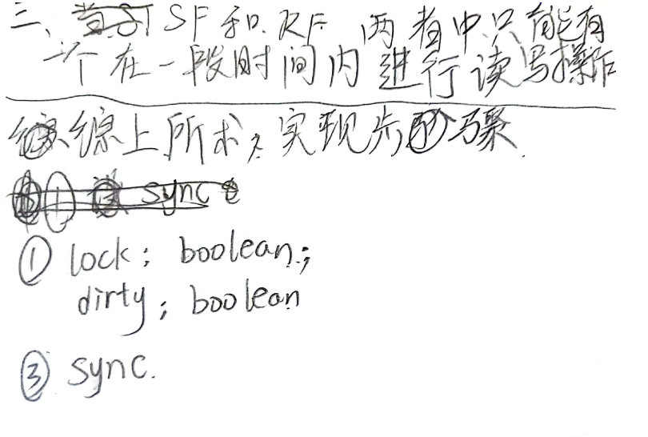

# TODO: 
> 1. 在每次题目结束时，自动保存题目开始和结束时间到每日Note中
> 2. 自动检测开始SR和结束SR的时间并记录到Note中
> 3. 从Section - Daily Activity中抽取出数据，并进行自动化罗列

# TODO: Data IO

# TODO: 可以直接打开在Excalidraw中所选择的Exercise

# TODO: 设计一个 练习库 UI

# TODO: 解决 Sync Issue.

# TODO:  一个保存上次Context的系统（可以是Setting, 或者直接保存在Base File里）

# TODO:  一个清除上次Context的系统

# TODO:  To implement a system that could let me specify which type of exercise ("New", "Drifter", "Stumble"....) I would
like to do this time

# TODO:  Create a class (called something like writer) to be responsible for file I/O

# TODO:  我感觉我接下来的这个想法是不是有点"过分"？ 就是相当于，我想将文字描述，通过语料库数据化，然后可以在日后检查库内是否存在语义相似的文字，可能提取出一些有用的信息？

# TODO:  是不是可以设计一个专门用于展示各类信息的Class Render? 比如当作一个已经做过的题目时，可以将以前做题时的感受给展示出来，从而可能避免丢失一些东西。

# TODO:  需要创造一个Planner类，用于管理我的计划。 每日题目数量随着时间的变换曲线应该是一个类似于arctanx的曲线，也就是说，速度每天都在增加，当但增加到一
定程度，由于物理上的限制（在这里是每天不可能有无限多的时间来作题），会趋于一个稳定值，并随之波动

# TODO:  需要制定一个策略，给予不同题目不同的权重，这样在题目选择时也不是随机的，比如在在一次做题中，花费在某题目上的时间过于多了，
说明对这个题目不是很熟悉，就应该多做一下这类题目算法方面，可以参加Space Repetition里的SM2,或者PageRank算法
